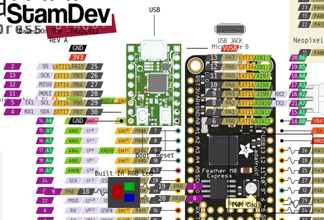

# STAMDEV 
## An arduino capable, super tiny dev board for the stm32l412 


## Contents 
* Intro
* Board pinout
* Working with the board
* Setup Guide (PlatformIO)
* Setup Guide (CubeIDE)
* Board modfications


## Intro 
STAMDEV is an stm32 based dev board designed to be a super tiny, super powerful microcontroller

the meaning of the word "STAM" is just, or pointless in hebrew. thus, STAMDEV is "Just a device" (or a pointless device if you will)

This Board Features:
* STM32L412KBU6 with 128KB FLASH, 40KB SRAM
* 32.768Khz for perscice timing and low power clocking 
* Micro USB Port Connected directly to STM32
* Built in RGB LED  
* 3.3V Regulator capable of driving 400mA for external devices
* 14 I/Os fanned out (8 analog input capable)
* 1 I2c fanned out
* 1 SPI fanned out
* Standard Breadboard size for easy prototyping
* preperation for STLINK connection


## Board Pinout 
Here is how the board is layed out:




## Working with the board 
This Board being stm32 based uses the on chip bootloader created by ST
this bootloader can be used to update the code of the MCU via UART/I2C/SPI and of course the **on board USB**

The bootloader turns the MCU to a DFU device that can be updated using many tools avilable

Note:
* ST Bootloader prefers the first interface that starts the update sequence with the device, thus it is suggested to disconnect any uart/i2c/spi device that may generate messages to the device


for more info about the stm32 bootloader:

[ST AN2606](https://www.st.com/resource/en/application_note/cd00167594-stm32-microcontroller-system-memory-boot-mode-stmicroelectronics.pdf)


To enter boot mode **While board is connected to power!**:

* Hold the boot button on the board


* Tap the reset button on the board


* Board should now appear on your computer in bootloader mode


## Setup Guide (PlatformIO)
Heres how to work with the board using platformIO

### Add Stamdev to list of boards 
* Go to your platformIO folder (Should be C:/Windows/Users/{YOUR USER}/.plaformio)

* Create a folder named boards


* Copy into boards folder `stamdev_l412kb.json`

* You should now see the board when you create a new project


### Adding support for Arduino 
As the board is kind of new, there is no offical support for it on the Stm32 Arduino Core, so we have a fork to support it.


* Create a new project in platformio


* Open the platform.ini file and add the following line:

```
platform_packages = 
	framework-arduinoststm32 @ https://github.com/maor1993/Arduino_Core_STM32.git
```


* Build the project!

### Upload from pio
To upload project from pio, use the boot+reset combination to enter boot mode then press upload from the pio platform

Note:
* There is a random bug where upload to board will fail, just keep retrying the upload button until it succeeds. 


## Setup Guide (Stm32CubeIDE)
You can one of the example projects as a reffence IOC file.

to upload to this board you'll also need the stm32cubeprogrammer as there is no ST-LINK


**TODO add avanced descipsion**


## Board Mods


### ST-LINK Connector 
If ST Link debugging is required, you can solder pins to J2. J2 is located on the Bottom of the PCB


The pinout for the J2 SWD connector is as follows:


the part number this connector was planned for is the Wurth Elektronik [61000421121](https://www.we-online.com/catalog/datasheet/61000421121.pdf)


### I2C bus external pullups removal
I2C Pins on the board use built in pullup resistors for the bus, if it is required to change these pins to be without pullups, you can remove R9 and R10 on the PCB


